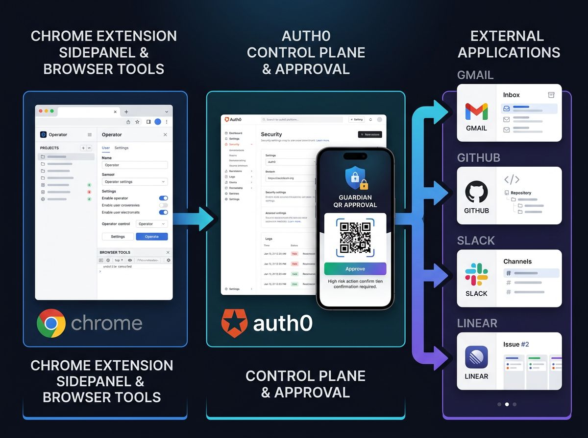
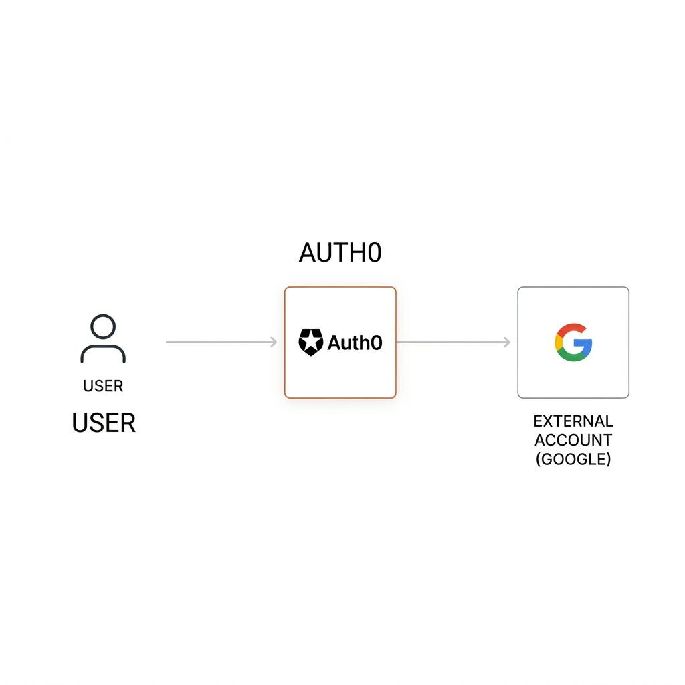
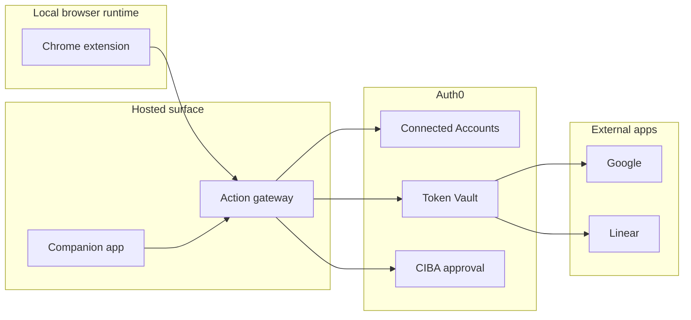
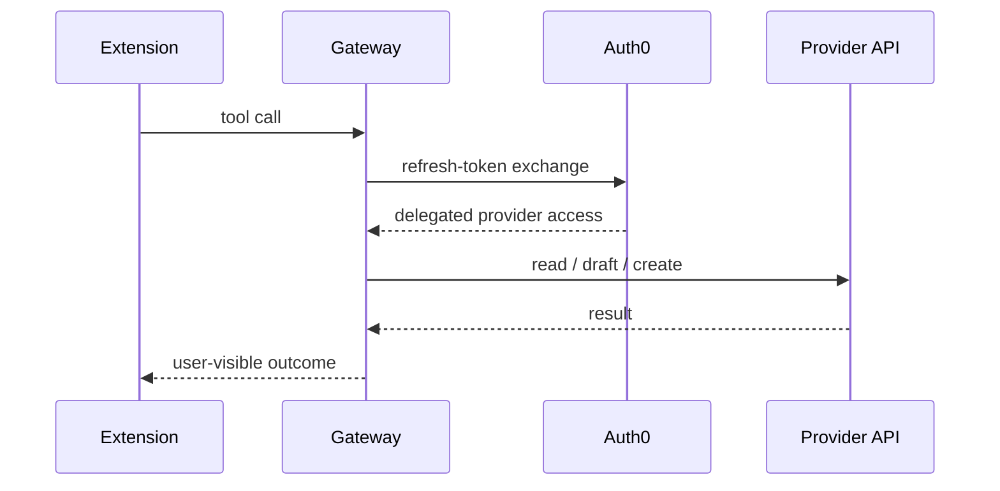
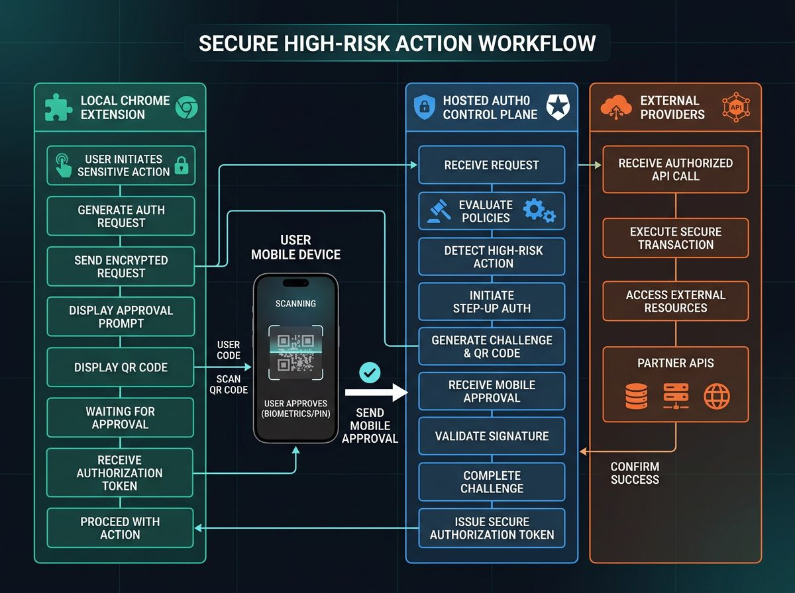
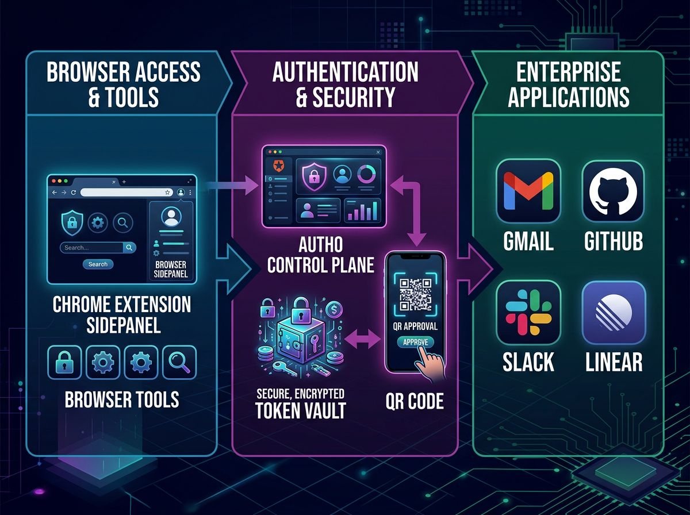

# Phantom Auth0

Phantom Auth0 is an Auth0-first hackathon build for [`Authorized to Act: Auth0 for AI Agents`](https://authorizedtoact.devpost.com/).

It reframes Phantom as a restricted local browser agent that can operate across external apps through a hosted Auth0 companion surface instead of raw third-party credentials embedded in the client. The core idea is simple:

- keep the agent local
- move identity and delegated authority into Auth0
- make high-risk actions explicit
- show the user what the agent is allowed to do

This repo is intentionally isolated from the original Phantom repo, deployment identity, and judging flow.



## Auth0 Setup

For a full end-to-end tenant rebuild guide, use:

- [docs/SETUP.md](https://github.com/youneslaaroussi/phantom-auth0/blob/main/docs/SETUP.md)

## Why This Is An Auth0 Project

This repo uses `Auth0 for AI Agents Token Vault` as part of the runtime path, not as a cosmetic integration.

The local extension does not directly own provider secrets. Instead:

1. the user signs in through Auth0
2. the user links external accounts through Connected Accounts
3. the server exchanges the Auth0 refresh token for provider access through Token Vault
4. state-changing actions can move through an Auth0 approval boundary
5. the companion app and extension both surface delegated state and action history

That makes the project about authorization architecture, delegated consent, and control boundaries for agents.



## What The Project Does

Phantom Auth0 is a two-part system:

- `extension/`: the local browser agent. It handles voice UI, page context, browser-native interaction, and the tool calls that reach the Auth0 gateway.
- `server/`: the hosted companion app and action gateway. It handles Auth0 login, Connected Accounts, Token Vault exchanges, pairing approval, and delegated action history.

Current user-visible capabilities:

- pair a local browser extension to a hosted companion app
- sign in with Auth0 Universal Login
- connect Google and Linear through Auth0 Connected Accounts
- check connected account state from inside the extension
- execute delegated Google and Linear actions through Token Vault
- track delegated action history in the companion app
- request approval for high-risk actions through Auth0 async authorization



## Auth0 Surfaces In This Repo

- Universal Login for user authentication
- Connected Accounts for provider delegation
- My Account API for connected-account management
- Token Vault exchange for provider access tokens
- CIBA-oriented async authorization for approval-required actions
- visible account state and action history in product UI

Official references used while building the hackathon version:

- [Token Vault](https://auth0.com/docs/secure/tokens/token-vault)
- [Connected Accounts for Token Vault](https://auth0.com/docs/secure/tokens/token-vault/connected-accounts-for-token-vault)
- [My Account API](https://auth0.com/docs/manage-users/my-account-api)
- [Application client grants](https://auth0.com/docs/get-started/applications/application-access-to-apis-client-grants)
- [Configure CIBA](https://auth0.com/docs/get-started/applications/configure-client-initiated-backchannel-authentication)
- [GitHub integration for Auth0 for AI Agents](https://auth0.com/ai/docs/integrations/github)

## Delegation Model

The extension is tied directly into the delegated action path. Auth0 is not a separate marketing layer.

- The runtime agent session exposes Auth0-backed tools such as account status, calendar availability, Gmail draft creation, Google Docs creation, Linear team listing, and Linear issue creation.
- Those tools resolve through the companion gateway.
- The gateway uses Auth0 refresh-token exchange and Token Vault to mint provider access on demand.
- High-risk actions enter an approval state before execution.



## Approval Boundaries

The repo distinguishes between low-risk and high-risk actions.

- Low-risk actions such as reads, drafts, and previews can execute immediately.
- High-risk actions such as sending, posting, creating, or mutating external state can require Auth0 approval.

This is the part of the project that matters most for the hackathon judging criteria around security model, user control, and production-aware implementation.



## Current Status

Validated in the repo and called out in product/docs:

- Auth0 login
- My Account API access
- MRRT-style refresh-token exchange
- Google Connected Account flow
- Google account state in the companion UI
- extension pairing
- Token Vault status visibility inside the extension
- server build
- extension build

Implemented in code, but still dependent on tenant-side setup before claiming complete end-to-end coverage:

- Auth0 async authorization for high-risk actions
- Google Docs scopes and reconnect flow
- Linear custom OAuth2 connection and Linear issue creation

Explored but not part of the recommended v1 path:

- GitHub
- Slack

## Provider Matrix

| Provider | Connected Account | Read Path | Draft / Preview Path | Approval-Required Path | Status |
| --- | --- | --- | --- | --- | --- |
| Google | Yes | Calendar availability, Docs list | Gmail draft, Doc draft | Gmail send, Calendar create, Doc create | Recommended |
| Linear | Implemented | Team listing | Issue draft | Issue creation | Needs tenant validation |
| GitHub | Experimental | Repo listing | Issue draft | Issue creation | Not part of v1 |
| Slack | Partial | N/A | Preview only | Post message | Not part of v1 |

## Architecture Notes

The project deliberately separates local execution from delegated authority.

- The extension remains the local client for context, interaction, and UX.
- The companion app becomes the trust surface for login, connected accounts, action history, and approval state.
- Auth0 becomes the authority layer for identity, delegation, token exchange, and optional step-up approval.
- External providers only see delegated calls from the gateway after Auth0 has established the right context.

That separation is the primary significant update in this hackathon repo.



## Local Development

### Server

```bash
cd /Users/mac/dev/phantom-auth0/server
npm install
npm run dev
```

Companion app:

- [http://localhost:8080/companion](http://localhost:8080/companion)

### Extension

```bash
cd /Users/mac/dev/phantom-auth0/extension
npm install
npm run dev
```

Then load the unpacked extension in Chrome and open the sidepanel.

## Environment

The server reads `server/.env`.

Important variables:

```bash
PORT=8080
PUBLIC_BASE_URL=http://localhost:8080
AUTH0_DOMAIN=your-tenant.us.auth0.com
AUTH0_CLIENT_ID=your_client_id
AUTH0_CLIENT_SECRET=your_client_secret
AUTH0_TOKEN_VAULT_CLIENT_ID=your_token_vault_client_id
AUTH0_TOKEN_VAULT_CLIENT_SECRET=your_token_vault_client_secret
AUTH0_API_AUDIENCE=https://phantom-auth0-api
AUTH0_MY_ACCOUNT_AUDIENCE=https://your-tenant.us.auth0.com/me/
AUTH0_GOOGLE_CONNECTION=google-oauth2
AUTH0_LINEAR_CONNECTION=linear
AUTH0_SLACK_CONNECTION=slack-oauth-2
```
